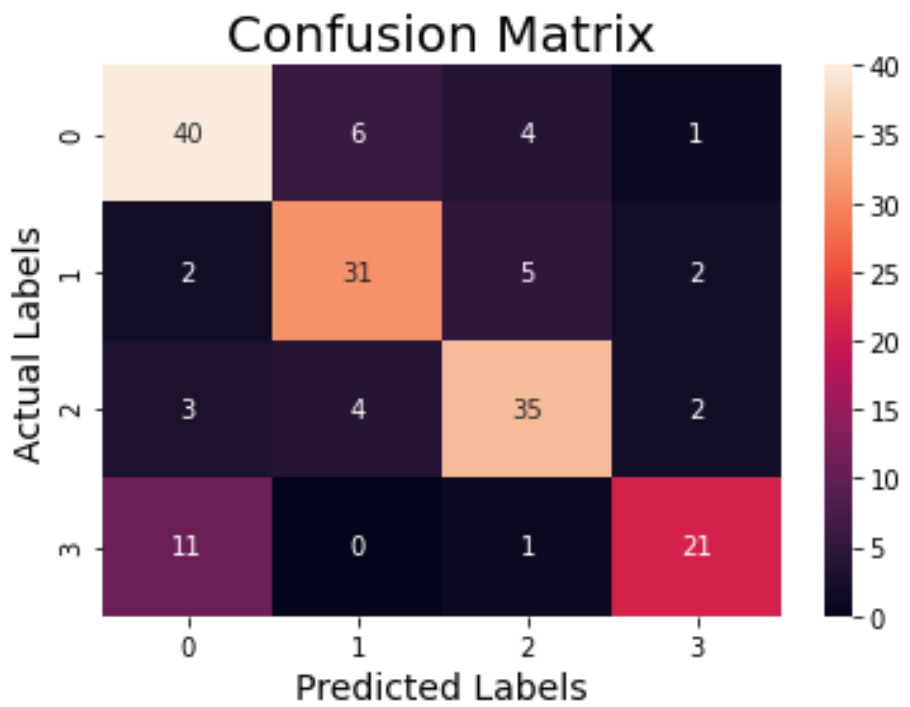

# SpeechEmotionRecogniser

## Overview

SpeechEmotionRecogniser is a machine learning project designed to identify emotions from speech. The model utilized is the `MLPClassifier`, and the dataset used is the RAVDESS (Ryerson Audio-Visual Database of Emotional Speech and Song). The original dataset contained 8 emotions, but for this project, we focused on 4 emotions: Neutral, Happy, Fearful, and Disgust.

## Features

- **Emotion Detection**: Identifies and classifies speech into one of four emotions.
- **Model**: Utilizes `MLPClassifier` for classification.
- **Dataset**: RAVDESS, with a focus on four specific emotions, those being --
- *Neutral*
- *Happy*
- *Fearful*
- *Disgust*

## Installation

To run this project, you need to have Python installed along with the following packages:

- `numpy`
- `pandas`
- `scikit-learn`
- `librosa`
- `matplotlib`
- `soundfile`
- `seaborn`

You can install these packages using pip:

```sh
pip install pandas soundfile numpy librosa scikit-learn matplotlib seaborn
```

Clone the Repository:
```sh
git clone https://github.com/PiyushSharma0/SpeechEmotionRecogniser.git
cd SpeechEmotionRecogniser
```

## Confusion Matrix

